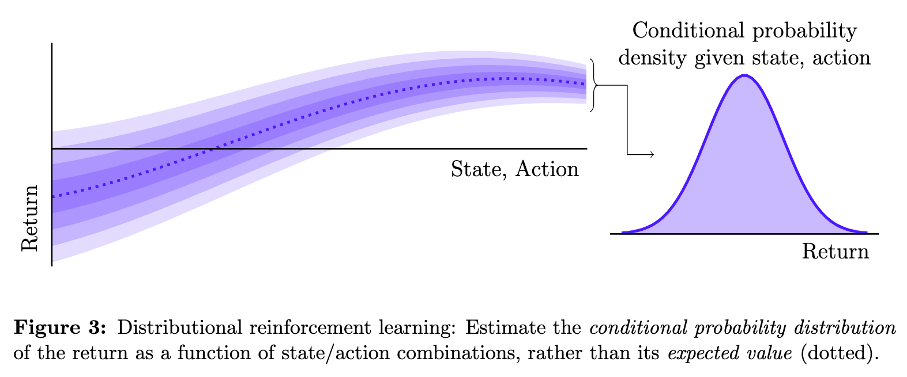

# Coursework Portfolio

Here is a directory of my advanced coursework projects from 2019 and
2020 during my Master of Computer Science at The University of Melbourne.

In 2021, having completed my coursework, I will embark upon my final year
Master's thesis project, studying the algebraic geometry of deep learning
algorithms with
[Assistant Professor Dr. Daniel Murfet](http://therisingsea.org/).
Wish me luck!

> #### Disclaimer
> 
> Publication here does not grant you permission to use this work.
> If you are a student, please do your own projects.
> Academic integrity is to be valued.

## Selected Projects

*Tailored Expectile Imputation Algorithms for Efficient
Expectile-based Distributional Reinforcement Learning*,
COMP90044 Research Methods, the University of Melbourne, semester 2, **2020**.
\[[research plan](farrugia2020distRL-review.pdf)\]
\[[presentation](farrugia2020distRL-talk.pdf)\]
\[written for a **general audience**\]
\[[project details](#comp90044-research-methods)\]

*The Promise of Distributional Reinforcement Learning*,
COMP90044 Research Methods, the University of Melbourne, semester 2, **2020**.
\[[literature review](farrugia2020distRL-review.pdf)\]
\[written for a **general audience**\]
\[[project details](#comp90044-research-methods)\]

*Expectile-based Distributional Reinforcement Learning and
Dopamine-associated Mental Disorders*,
227-0395-00L Neural Systems, ETH Zürich, semester 1, **2020**.
\[[report](farrugia2020expectiles-dopamine.pdf)\]
\[[project details](#227-0395-00l-neural-systems)\]
\[**group work**: main contributions in reading RL literature,
implementation, writing sections 1.1, 1.3, 2, 3, appendix A\]

*Implementing Expectation-Maximisation Algorithm for Gaussian Mixture Model
Parameter Estimation*,
252-0526-00L Statistical Learning Theory, ETH Zürich, semester 1, **2020**.
\[[code](https://github.com/matomatical/gmm-em-algorithm)\]
\[personal study project\]
\[[class details](#252-0526-00l-statistical-learning-theory)\]

*Scalable Massively Multi-author Profiling and Attribution of Micro-Messages*,
COMP90051 Statistical Machine Learning, the University of Melbourne,
semester 2, **2019**.
\[[report](farrugia2019space.pdf)\]
\[[code](https://github.com/matomatical/SML-project-1)\]
\[[kaggle](https://www.kaggle.com/c/whodunnit) (3rd place)\]
\[[project details](#COMP90051-statistical-machine-learning)\]
\[**group work**: main contributions in scalability/algorithmic improvements,
designing leading model, mathematical details in report\]

## Complete List of Coursework and Projects

Contents:

* Semester 2, 2020 (Part-time @ University of Melbourne, virtual campus 🦠)
  * [COMP90044 Research Methods](#comp90044-research-methods)
* Semester 1, 2020 (Exchange @ ETH Zürich, interrupted but continued online)
  * [227-0395-00L Neural Systems](#227-0395-00l-neural-systems)
  * [252-0526-00L Statistical Learning Theory](#252-0526-00l-statistical-learning-theory)
  * [252-1424-00L Models of Computation](#252-1424-00l-models-of-computation)
  * [363-0588-00L Complex Networks](#363-0588-00l-complex-networks)
  * 363-0543-00L Agent-Based Modelling of Social Systems [audited]
  * 227-0694-00L Game Theory and Control [audited]
* Semester 2, 2019 (Part-time @ University of Melbourne)
  * [COMP90051 Statistical Machine Learning](#comp90051-statistical-machine-learning)
  * [PHYC90045 Introduction to Quantum Computing](#phyc90045-introduction-to-quantum-computing)
* Semester 1, 2019 (Part-time @ University of Melbourne)
  * [COMP90042 Web Search and Text Analysis](#comp90042-web-search-and-text-analysis)
  * [COMP90045 Programming Language Implementation](#comp90045-programming-language-implementation)

#### COMP90044 Research Methods

This subject taught the fundamentals of research writing and conduct,
using a mock research topic
(I chose *distributional reinforcement learning*).
[Handbook link](https://handbook.unimelb.edu.au/2020/subjects/comp90044/).
Final grade forthcoming (est. 90--95).

Assessment:

* For a first assignment, I compiled a
  [literature review](farrugia2020distRL-review.pdf)
  on distributional reinforcement learning.

    I wrote this review for a general CS audience, which was initially
    challenging given the mathematical tone of much of the literature.
    In the end, I was impressed by how I was able to distill the important
    messages without resorting to any equations. In fact, on several
    occasions I found I was only attempting to introduce mathematical
    detail for its own sake, and I obtained a more cohesive review
    after removing it.

    

* For the second assignment, I designed and reported a
  [research plan](farrugia2020distRL-plan.pdf)
  for investigating a research question identified during my review.

    Once again, this plan was written for a general audience and I was
    impressed with my success at avoiding technical language and still
    communicating my ideas.

    Note: I did not actually execute this research plan, and indeed the
    plan is written for a very ideally-resourced researcher. However, I
    am considering following up on my question in the future.

* For the final assignment, I prepared a 5 minute talk describing my plan,
  for which I submitted this
  [transcript and slide deck](farrugia2020distRL-talk.pdf).

    Note: I was not asked to present this talk, but I did prepare as if to
    present it as part of validating the timing and balance of the talk.

#### 227-0395-00L Neural Systems

An introduction to neuroscience for engineers. This subject pushed me
far outside of my comfort zone, but rewarded me with a basic knowledge
of the fundamentals of neuroscience and also reinforcement learning
(I read up on RL for the project).
[Details](http://www.vvz.ethz.ch/Vorlesungsverzeichnis/lerneinheit.view?lang=en&semkez=2020S&lerneinheitId=135004&).
ECTS credits: 6.
Final grade: 6.0 (6.0 scale).

Assessment:

* The major project was an open-ended interdisciplinary team research
  project. Supervised by our lecturer, we were asked to:

  > find some interesting parallel between machine learning and
  > neuromodulation, and see if an insight from either of these
  > fields can inform the other.

  Over the semester we developed some ideas concerning DeepMind's
  *distributional hypothesis of dopaminergic signalling*.
  The result was our
  [final report](farrugia2020expectiles-dopamine.pdf).

  A brief summary of the key points:

  * DeepMind's Nature paper claims that dopaminergic neurons encode
    distributional information in their activity, akin to signals
    in the nascent *distributional reinforcement learning* paradigm,
    and in particular that the mammalian reward system may implement
    expectile-based distributional RL.
  * We fleshed this out into an architectural model of the reward system
    as an extension of the neural actor-critic architecture, and
    identified the expensive 'imputation step' of current expectile-based
    distributional RL algorithms as a biologically implausible bottleneck.
  * We investigated more plausible imputation strategies, and we showed
    in proof-of-concept simulation experiments that the imputation process
    is vital to the consistency of learning, since plausible low-level
    defects in the model could manifest themselves at the level of behaviour
  * We speculated that if the distributional hypothesis is correct then
    these defects could underly reward-system-related mental disorders such
    as addiction and Parkinson's disease.
  * We found a number of other minor insights which we included in the
    appendix.

  This was a **group project**.
  The whole group met regularly to discuss and eventually crystallise our
  hypotheses and model.
  I was partly responsible for understanding the technical RL side of the
  work, and I am indebted to my team members for helping me to understand
  the neuroscience side.
  I was also responsible for designing and running the majority of our
  simulation experiments.
  For the report, I was the main contributor to sections 1.1, 1.3, 2, 3,
  and the sole constributor to appendix A.
  Please see these sections for examples of my work.

  Some of the code I used in these experiments can be found in other
  repositories, see:

    * [an efficient algorithm for computing sample expectiles](https://github.com/matomatical/expectiles), and
    * [working notebooks for exploring expectiles and distributional RL](https://github.com/matomatical/neuRL).

  This was a substantial project, and it pushed me to learn a lot about
  the reward system (not to mention reinforcement learning, which I had
  actually never studied before---I read all of Sutton and Barto over a
  few weeks during this project).
  I also got to practice writing RL and ML Python code using the scientific
  stack and, though most of our eventual experiments were tabular, a little
  tensorflow.

#### 252-0526-00L Statistical Learning Theory

This subject pushed my mathematical skills to a new level, and
deepened my understanding of statistics and machine learning.
[Details](http://www.vvz.ethz.ch/Vorlesungsverzeichnis/lerneinheit.view?lerneinheitId=136191&semkez=2020S&ansicht=KATALOGDATEN&lang=en).
ETCS credits: 7.
Final grade: 5.75 (6.0 scale).

Assessment: 

* The class involved fortnightly programming projects using Jupyter notebooks,
  numpy, scipy, matplotlib, etc.

  I will not publish my work for these projects because, as I understand,
  the same projects will be used in future semesters.

  These projects pushed my technical skills perhaps the furthest during my
  exchange experience, as I really had to master numpy and some aspects of
  scipy to get the algorithms to run at the scale that was required.
  In the end I was impressed by how far I had come in my ability to write
  efficient scalable code using vectorisation and matrix operations.

* However, some code I whipped up while studying similar topics during the
  semester is available in other repositories:

  * [Constant-shift embedding method for graph layout](https://github.com/matomatical/cse-graph-layout).
  * [Estimation of Gaussian mixture model parameters using EM algorithm](https://github.com/matomatical/gmm-em-algorithm).
    

#### 252-1424-00L Models of Computation

Matthew Cook's whistle-stop tour of many exciting and exotic models of
computation, beyond the traditional FSAs, CFGs and TMs.
[Details](http://www.vvz.ethz.ch/Vorlesungsverzeichnis/lerneinheit.view?lerneinheitId=136149&semkez=2020S&ansicht=KATALOGDATEN&lang=en).
ETCS credits: 6.
Final grade: 6.0 (6.0 scale).

Assessment: 

* This subject offered challenging weekly puzzles, several for each new model
  of computation which we studied.
  I was proud to complete every puzzle successfully. However, so as not to
  spoil these puzzles for future students I will not publish my solutions.

  The study of so many of models gave me a broader perspective on computation
  itself, which remains one of the most fascinating ideas I have ever studied.

* The final project involved designing and studying and then delivering a
  lecture about my own original model of computation.

  I am not certain how original my idea was, but I explored what I called
  a *society of finite-state transducers*, which was the result of composing
  the input/output streams of finite-state transducers in a (finite or
  infinite) network.
  Regrettably, I don't have a recording of the presentation, which was
  partly at a virtual whiteboard.

#### 363-0588-00L Complex Networks
  
This class was an introduction to complex systems research using network models.
[Details](http://www.vvz.ethz.ch/Vorlesungsverzeichnis/lerneinheit.view?lerneinheitId=135015&semkez=2020S&ansicht=KATALOGDATEN&lang=en).
ECTS credits: 4.
Final grade: 6.0 (6.0 scale)

Assessment:

* In weekly coding exercises, we implemented many ideas from complex networks
  such as random graph models and various measures of centrality.

  I will not to share my solutions since the same exercises are likely to
  be used in future semesters.

  However, I really learned a lot about using Python's scientific stack
  (esp. numpy, matplotlib) during these exercises. I pushed myself to
  vectorise as many components of the network algorithms as as possible.
  I essentially became infamous in our weekly tutorials for saying
  'did you know you can do that faster using numpy?' whenever the tutor
  presented their solution.

#### COMP90051 Statistical Machine Learning

Benjamin Rubinstein's subject on advanced topics in statistics and machine
learning, including various equivalent perspectives on these methods.
[Handbook link](https://handbook.unimelb.edu.au/2019/subjects/comp90051/).
Final grade: 99.

Assessment:

* Our major project was an *extreme authorship attribution* group challenge.
  My team and I implemented several models for authorship attribution of
  micro textual data (Tweets) for over 10,000 users.
  We placed third on the
  [class leaderboard](https://www.kaggle.com/c/whodunnit)
  in the public and held-out evaluations.
  Our approach is summarised in our [report](farrugia2019space.pdf)
  and our code can be found in
  [this repository](https://github.com/matomatical/SML-project-1).

  My team and I collaboratively implemented and evaluated our approach.
  I was chiefly responsible for the mathematical details and was able to
  contribute some algorithmic direction to help our programs scale (in
  hindsight, we might have eeked out even more performance by switching
  from pure python to numpy in key places). We also worked together
  closely on the report, however, afterward submission, I added the
  appendix on scalable implementation tactics alone.

  I enjoyed this project a lot. I felt like we were working very close to
  the forefront of this field, because we were innovating over the
  implementation and approaches of the related works which we started from
  and we were able to achieve reasonable success in this very challenging,
  sparse-data problem. Some proffessors commented that we might have come
  up with truly novel contributions in this area.

#### PHYC90045 Introduction to Quantum Computing

A comprehensive introduction to quantum computing for non-physicists.
[Handbook link](https://handbook.unimelb.edu.au/2019/subjects/phyc90045/).
Final grade: 99.

* We studied topics all the way from the basic one-qubit gates to
  the QFT, Shor's algorithm, quantum annealing architectures, quantum
  communication, error-correcting surface codes, quantum computational
  complexity theory, and more.

* We used the University of Melbourne's Qauntum User Interface,
  and IBM Q's real quantum computers.
  (There was also a class on using a real DWave annealer, but I missed it!)
  
* Since the assignments are re-used from year to year, I won't publish my
  solutions.

#### COMP90042 Web Search and Text Analysis

Trevor Cohn's subject on advanced topics in modern information retrieval and
natural language processing.
[Handbook link](https://handbook.unimelb.edu.au/2019/subjects/comp90042/).
Final grade: 98.

Assessment:

* The main project in this class was a pair project to implement an
  *automatic fact verification system* based on the Wikipedia-derived
  'FEVER' dataset.

  My project partner and I were able to achieve early leading
  performance on the class leaderboard using a multi-stage evidence
  retrieval and classification system we dubbed SHERLOCK
  (we were eventually left behind---it seems we should have just used
  BERT for sentence embeddings!).
  Our work is summarised in our [final report](farrugia2019sherlock.pdf)
  (unfortunately our code is not publically available).

  This project was my first experience implementing, training, and
  tuning machine learning models. I worked closely with my project partner
  throughout the entire project. However, I was chiefly responsible
  for the first half of our multi-step pipeline.

#### COMP90045 Programming Language Implementation

This subject taught the principles of compiler design and implementation,
and we implemented a compiler for a toy language using Haskell.
[Handbook link](https://handbook.unimelb.edu.au/2019/subjects/comp90045/).
Final grade: 99.

Assessment:

* Our semester project was to implement, in teams, a compiler for a toy
  language called 'Goat'. The compiler was implemented in Haskell. We used
  the Parsec monadic parser combinator library, and implemented a monadic
  code generation library too. We also explored lexer and parser generators
  for Haskell (alex and happy).

  The code for our final compiler, along with project specifications, is
  available in
  [this separate repo](https://github.com/matomatical/Goatlang-Compiler).

  This assignment really pushed all of our Haskell skills, especially with
  monadic programming. We all worked closely together on the project, so it
  is difficult to identify any part which is chiefly my own contribution.

