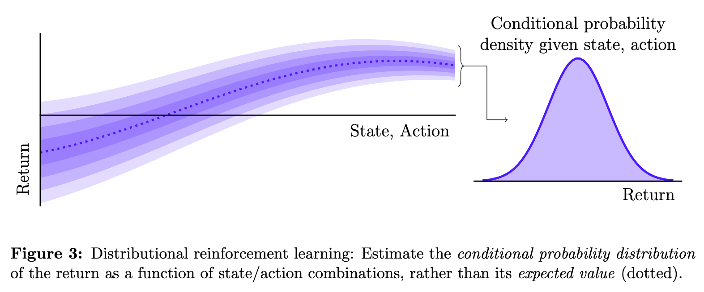

# Coursework Portfolio

A directory of of my advanced coursework projects from the Master of Computer
Science at The University of Melbourne

## Notes

* The reports written for my university projects usually end up quite
  polished by the submission deadline, but the code usually does *not*.
  This code is usually written over a few weeks and with minimal effort in
  readability. Here be dragons.

* Some of the work listed here is joint work with other students, and/or
  benefits from the guidance of lecturers or teaching assistants.
  I have attempted to roughly outline which contributions are my own, and
  I am grateful to have been able to work with such supportive peers.

* Publication here does not grant you permission to use this work.
  If you are a student, please do your own projects, because academic
  integrity is to be valued.
  If you are not a student, please contact me to request a license before
  using anything in this repository.

## Projects

The following is a list of my most recent substantial coursework projects,
with links to samples of my work, and some comments on what I learned.

### Table of Contents

* [2021](#2021)
* [Semester 2, 2020](#semester-2-2020-)
  * [COMP90044 Research Methods](#comp90044-research-methods)
* [Semester 1, 2020](#semester-1-2020-)
  * [227-0395-00L Neural Systems](#227-0395-00l-neural-systems)
  * [252-0526-00L Statistical Learning Theory](#252-0526-00l-statistical-learning-theory)
  * [252-1424-00L Models of Computation](#252-1424-00l-models-of-computation)
  * [363-0588-00L Complex Networks](#363-0588-00l-complex-networks)
* Semester 2, 2019
  * COMP90051 Statistical Machine Learning
  * PHYC90045 Introduction to Quantum Computing
* Semester 1, 2019
  * COMP90049 Web Search and Text Analysis
  * COMP90045 Programming Language Implementation

### 2021

In 2021, having completed my coursework, I will embark upon my
1-year Master's thesis project.
The plan is to study the mathematics of deep learning algorithms
with [Assistant Professor Dr. Daniel Murfet](http://therisingsea.org/)
over in the School of Mathematics and Statistics.
Wish me luck!

### Semester 2, 2020 🦠 

This semester was completed part-time at the University of Melbourne's
virtual campus.

#### COMP90044 Research Methods

This subject taught the fundamentals of research writing and conduct,
using a mock research topic.
[Handbook link](https://handbook.unimelb.edu.au/2020/subjects/comp90044/).
Final grade forthcoming.

Assessment:

* Following some of my work from the previous semester,
  I chose the topic of *distributional reinforcement learning*.

* For the first assignment, I compiled a
  [literature review](2020s2-comp90044/farrugia2020distRL-review.pdf)
  on distributional reinforcement learning.

    I wrote this review for a general CS audience, which was initially
    challenging given the mathematical tone of much of the literature.
    In the end, I was impressed by how I was able to distill the important
    messages without resorting to any equations. In fact, on several
    occasions I was only attempting to introduce mathematical detail for
    its own sake, and I obtained a more cohesive review after removing it.
    (For a more technical report, see my work for Neural Systems from 2020s1.)

    

* For the second assignment, I designed and reported a
  [research plan](2020s2-comp90044/farrugia2020distRL-plan.pdf)
  for investigating a research question identified during my review.

    Once again, this plan was written for a general audience and I was
    impressed with my success at avoiding technical language and still
    communicating my ideas.

    Note: I did not actually execute this research plan, and indeed the
    plan is written for a very ideally-resourced researcher. However, I
    am considering following up on my question in the future.

* For the final assignment, I prepared a 5 minute talk describing my plan,
  for which I submitted this
  [transcript and slide deck](2020s2-comp90044/farrugia2020distRL-talk.pdf).

    Note: I was not asked to present this talk, but I did prepare as if to
    present it as part of validating the timing and balance of the talk.

### Semester 1, 2020 🇨🇭🦠

This semester, I went on an exchange to ETH Zürich. I had to return early
due to the pandemic, but after recovering from this disruption I was able
to complete my studies from Melbourne (living on Zürich time to attend
live Zoom lectures). I studied four classes for credit and audited two
additional classes (one on agent-based modelling and another on game
theory and control systems).

#### 227-0395-00L Neural Systems

This subject, billed as 'an introduction to neuroscience for engineers',
pushed me far outside of my comfort zone.
[Details](http://www.vvz.ethz.ch/Vorlesungsverzeichnis/lerneinheit.view?lang=en&semkez=2020S&lerneinheitId=135004&).
ECTS credits: 6.
Final grade: 6.0 (6.0 scale).

Assessment:

* The major project work was an open-ended interdisciplinary team research
  project.
  Supervised by our lecturer, we were asked to, essentially,
  'find some interesting parallel between machine learning and
  neuromodulation, and see if one of these fields can inform the other'.

  The result is captured in our
  [final report](2020s1-227-0395-00L/farrugia2020expectiles-dopamine.pdf),
  and I give a brief summary of the key points below:

* Over the semester we developed some ideas concerning Deep Mind's
  *distributional hypothesis of dopaminergic signalling*. In summary:

  * Their Nature paper claims that dopaminergic neurons encode
    distributional information in their activity, akin to signals
    in the nascent *distributional reinforcement learning* paradigm,
    and in particular that the mammalian reward system may implement
    expectile-based distributional RL.
  * We fleshed this out into an architectural model of the reward system
    as an extension of the neural actor-critic architecture, and
    identified the expensive 'imputation step' of current expectile-based
    distributional RL algorithms as a biologically implausible bottleneck.
  * We investigated more plausible imputation strategies, and we showed
    in proof-of-concept simulation experiments that the imputation process
    is vital to the consistency of learning, since plausible low-level
    defects in the model could manifest themselves at the level of behaviour
  * We speculated that if the distributional hypothesis is correct then
    these defects could underly reward-system-related mental disorders such
    as addiction and Parkinson's disease.

* This was a group project, and the whole group met regularly to discuss
  and eventually crystallise our hypotheses and model.
  I was partly responsible for understanding the technical RL side of the
  work, and I am indebted to my team members for helping me to understand
  the neuroscience side. I was also responsible for designing and running
  the majority of our simulation experiments.

  In the report, I was the main contributor to sections 1.1, 1.3, 2, 3, and
  appendix A. Please see these sections for examples of my work.

  Some of the code used in our experiments can be found in other
  repositories, see:

    * [an efficient algorithm for computing sample expectiles](https://github.com/matomatical/expectiles).
    * [working notebooks for exploring expectiles and distributional RL](https://github.com/matomatical/neuRL).

#### 252-0526-00L Statistical Learning Theory

This subject pushed my mathematical background and deepened my understanding
of statistics and machine learning.
[Details](http://www.vvz.ethz.ch/Vorlesungsverzeichnis/lerneinheit.view?lerneinheitId=136191&semkez=2020S&ansicht=KATALOGDATEN&lang=en).
ETCS credits: 7.
Final grade: 5.75 (6.0 scale).

* The class involved fortnightly programming projects using Jupyter notebooks,
  numpy, scipy, matplotlib, etc.

    I will not publish my work for these projects because, as I understand,
    the same projects will be used in future semesters.

* However, some code I whipped up while studying similar topics during the
  semester is available in other repositories:
  * [Constant-shift embedding method for graph layout](https://github.com/matomatical/cse-graph-layout)
  * [Estimation of Gaussian mixture model parameters using EM algorithm](https://github.com/matomatical/gmm-em-algorithm)
    

#### 252-1424-00L Models of Computation

A whistle-stop tour of many exciting and exotic models of computation, beyond
the traditional FSAs, CFGs and TMs.
[Details](http://www.vvz.ethz.ch/Vorlesungsverzeichnis/lerneinheit.view?lerneinheitId=136149&semkez=2020S&ansicht=KATALOGDATEN&lang=en).
ETCS credits: 6.
Final grade: 6.0 (6.0 scale).

* This subject offered challenging weekly puzzles, several for each new model
  of computation which we studied.

    I was proud to complete every puzzle successfully. However, so as not to
    spoil these puzzles for future students I will not publish my solutions.

* The final project involved designing and studying and then lecturing about
  my own model of computation.

TODO: Add details.

#### 363-0588-00L Complex Networks
  
[Details](http://www.vvz.ethz.ch/Vorlesungsverzeichnis/lerneinheit.view?lerneinheitId=135015&semkez=2020S&ansicht=KATALOGDATEN&lang=en).
ECTS credits: 4.
Final grade: 6.0 (6.0 scale)

## TODO:

Notes to self:

* Add project details for neural systems group project.
* Add final project details for models of computation.
* Add projects details and reports from 2019 machine learning classes and
  compiler project from PLI.
* Add Sierpinski triangle image for Models of Computation.
